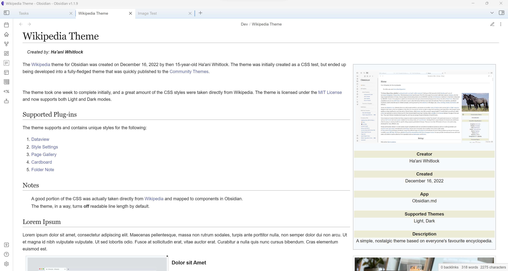

# Dekalb

>[!info|normal]
>**Location:** DeKalb, Illinois  
>**Established:** 1856  
>**Population:** 43,255 (2020 Census)  

## Overview
DeKalb is a city in northern Illinois, best known for being home to Northern Illinois University. It has a rich history rooted in agriculture and education.

## History
Founded in the mid-19th century, DeKalb played a significant role in the agricultural advancements of the region, particularly in the development of hybrid corn.

## Geography
DeKalb is located in the Midwest, approximately 65 miles west of Chicago. It features a mix of urban and rural landscapes.

## Education
- **Northern Illinois University:** A major public university offering a variety of undergraduate and graduate programs.
- **Community Colleges:** Serve the local population with accessible education options.

## Economy
The local economy is driven by education, agriculture, and manufacturing, with several businesses contributing to the employment landscape.

## Notable Residents
- **Barb T. A. -** Noted for contributions to the local community and education.
- **John Smith -** Influential figure in local politics.

## References
- [City of DeKalb Official Website](http://www.cityofdekalb.com)
